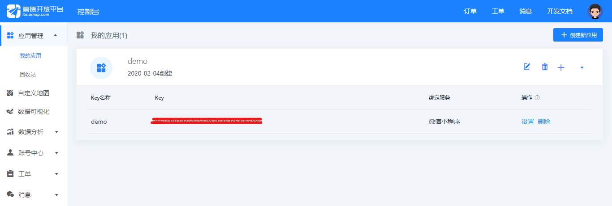
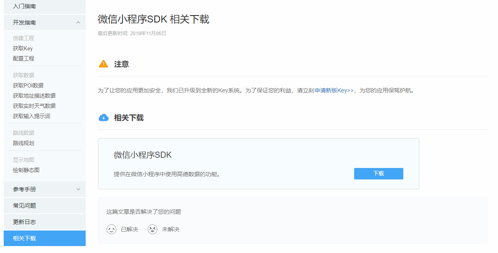
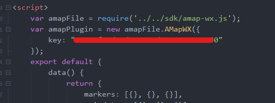

###### uniapp中引用高德地图官方微信小程序SDK进行webapp开发

<!--- more --->

##### 1.获取高德地图开放平台 Key

> 高德地图Key：https://lbs.amap.com/dev/key/app




##### 2.下载高德地图微信小程序SDK

> 微信小程序SDK：https://lbs.amap.com/api/wx/download




##### 3.本地项目导入SDK和高德Key

```vue
var amapFile = require('../../sdk/amap-wx.js');

var amapPlugin = new amapFile.AMapWX({
	key: ""
});
```




##### 4.界面代码

```vue
<map style="width: 100%; height: 100vh;" :latitude="latitude" :longitude="longitude" scale="16" :markers=markers show-location="true" :circles="circles" :polyline="polyline" @markertap="getRegeo">
</map>
```


##### 5.data数据

```javascript
data() {
	return {
		markers: [{}, {}, {}],
		poisdatas: [{}, {}, {}],
		title: 'map',
		latitude: null,
		longitude: null,
		polyline: [],
		distance: null,
		cost: null,
		circles: [{ //利用定位点画圆
			latitude: 38.830794,
			longitude: 105.679409,
			color: "#0091ff",
			fillColor: "#ffffffAA",
			strokeWidth: 2,
			radius: 200 //半径，可用于计算圆的面积
		}],
		Si: null,
		mapStaticImg: ''
	}
}
```


###### 6.获取当前定位

```javascript
uni.getLocation({
	type: 'gcj02',
	success: function(res) {
		console.log('当前位置的经度：' + res.longitude);
		console.log('当前位置的纬度：' + res.latitude);
		that.longitude = res.longitude;
		that.latitude = res.latitude;
	}
});
```


##### 7.poi查询

```javascript
amapPlugin.getPoiAround({
	success: function(data) {
		that.markers = data.markers;
		that.poisdatas = data.poisData;
		var markers_new = [];
		that.markers.forEach(function(item, index) {
			markers_new.push({
				id: item.id, //marker 序号
				width: item.width, //marker 宽度
				height: item.height, //marker 高度
				iconPath: item.iconPath, //marker 图标路径
				latitude: item.latitude, //marker  纬度
				longitude: item.longitude, //marker 经度
				//自定义标记点上方的气泡窗口
				callout: {
					padding: 2, //callout 文本边缘留白
					fontSize: 15, //callout  文字大小
					bgColor: 'blue', //callout 背景颜色
					color: '#6B8E23', //callout 文字颜色
					borderRadius: 5, //边框圆角
					display: 'BYCLICK', //callout 'BYCLICK':点击显示; 'ALWAYS':常显
					content: that.poisdatas[index].name //地理位置名称
				}
			})
		})
		that.markers = markers_new;
		// console.log("data", JSON.stringify(that.poisdatas));
	},
	fail: function(info) {
		//失败回调
		console.log("info", info)
	}
});
```


##### 8.绘制静态图

```javascript
wx.getSystemInfo({
	success: function(data){
		// var height = data.windowHeight;
		var width = data.windowWidth;
		var height = 500;
		var size = width + "*" + height;
		amapPlugin.getStaticmap({
			 zoom: 19,
			 size: size,
			 scale: 2,
			 location: "105.679409,38.830794",
			 // markers: "mid,0xFF0000,A:116.37359,39.92437;116.47359,39.92437",
			 labels: "1,2,0,16,0xFFFFFF,0x008000:105.679409,38.830794",
		     paths:"10,0x0000ff,0.1,0x0000ff,0.7:105.679409,38.830794;
		     105.67937,38.830828;105.679611,38.830857;105.679638,38.830724;
		     105.679663,38.830565;105.679718,38.830273",
			 // paths:'10,0x0000ff,1,,:116.31604,39.96491;116.320816,39.966606;
			 116.321785,39.966827;116.32361,39.966957',
			 success: function(data){
			    this.mapStaticImg = data.url
			    console.log(this.mapStaticImg)
			 },
			 fail: function(info){
				console.log(info)
			    // wx.showModal({title:info.errMsg})
			 }
		})		
	}
});
```


##### 9.导航，计算实际路线长度，打车计费

```javascript
amapPlugin.getDrivingRoute({
	origin: '105.679409,38.830794',
	destination: '105.702692,38.838513',
	success: function(data) {
		var points = [];
		if (data.paths && data.paths[0] && data.paths[0].steps) {
			var steps = data.paths[0].steps;
			for (var i = 0; i < steps.length; i++) {
				var poLen = steps[i].polyline.split(';');
				for (var j = 0; j < poLen.length; j++) {
					points.push({
						longitude: parseFloat(poLen[j].split(',')[0]),
						latitude: parseFloat(poLen[j].split(',')[1])
					})
				}
			}
		};
		that.polyline = [{
			points: points,
			color: "#0091ff",
			width: 6
		}];
		if (data.paths[0] && data.paths[0].distance) {
			that.distance = '距离：' + data.paths[0].distance + '米';
			console.log(that.distance);
		}
		if (data.taxi_cost) {
			that.cost = '打车约：' + parseInt(data.taxi_cost) + '元'
			console.log(that.cost);
		}
	},
	fail: function(info) {
		console.log("失败")
	}
})
```


##### 10.项目整体代码

```vue
<template>
	<view>
		<map style="width: 100%; height: 100vh;" :latitude="latitude" :longitude="longitude" scale="16" :markers=markers
		 show-location="true" :circles="circles" :polyline="polyline" @markertap="getRegeo">
		</map>
	</view>
</template>

<script>
	var amapFile = require('../../sdk/amap-wx.js');
	var amapPlugin = new amapFile.AMapWX({
		key: ""
	});
	export default {
		data() {
			return {
				markers: [{}, {}, {}],
				poisdatas: [{}, {}, {}],
				title: 'map',
				latitude: null,
				longitude: null,
				polyline: [],
				distance: null,
				cost: null,
				circles: [{
					latitude: 38.830794,
					longitude: 105.679409,
					color: "#0091ff",
					fillColor: "#ffffffAA",
					strokeWidth: 2,
					radius: 200 //半径，可用于计算圆的
				}],
				Si: null,
				mapStaticImg: ''
			}
		},
		onLoad() {
			this.Pi();
			var that = this;
			//获取当前定位
			uni.getLocation({
				type: 'gcj02',
				success: function(res) {
					console.log('当前位置的经度：' + res.longitude);
					console.log('当前位置的纬度：' + res.latitude);
					that.longitude = res.longitude;
					that.latitude = res.latitude;
				}
			});

			//poi查询
			amapPlugin.getPoiAround({
				success: function(data) {
					that.markers = data.markers;
					that.poisdatas = data.poisData;
					var markers_new = [];
					that.markers.forEach(function(item, index) {
						markers_new.push({
							id: item.id, //marker 序号
							width: item.width, //marker 宽度
							height: item.height, //marker 高度
							iconPath: item.iconPath, //marker 图标路径
							latitude: item.latitude, //marker  纬度
							longitude: item.longitude, //marker 经度
							//自定义标记点上方的气泡窗口
							callout: {
								padding: 2, //callout 文本边缘留白
								fontSize: 15, //callout  文字大小
								bgColor: 'blue', //callout 背景颜色
								color: '#6B8E23', //callout 文字颜色
								borderRadius: 5, //边框圆角
								display: 'BYCLICK', //callout 'BYCLICK':点击显示; 'ALWAYS':常显
								content: that.poisdatas[index].name //地理位置名称
							}
						})
					})
					that.markers = markers_new;
					// console.log("data", JSON.stringify(that.poisdatas));
				},
				fail: function(info) {
					//失败回调
					console.log("info", info)
				}
			});

			//绘制静态图
			wx.getSystemInfo({
			  success: function(data){
			    // var height = data.windowHeight;
			    var width = data.windowWidth;
				var height = 500;
			    var size = width + "*" + height;
			    amapPlugin.getStaticmap({
			      zoom: 19,
			      size: size,
			      scale: 2,
			      location: "105.679409,38.830794",
			      // markers: "mid,0xFF0000,A:116.37359,39.92437;116.47359,39.92437",
			      labels: "1,2,0,16,0xFFFFFF,0x008000:105.679409,38.830794",
			      paths: "10,0x0000ff,0.1,0x0000ff,0.7:105.679409,38.830794;105.67937,38.830828;105.679611,38.830857;105.679638,38.830724;105.679663,38.830565;105.679718,38.830273",
			      // paths: '10,0x0000ff,1,,:116.31604,39.96491;116.320816,39.966606;116.321785,39.966827;116.32361,39.966957',
			      success: function(data){
			        this.mapStaticImg = data.url
					console.log(this.mapStaticImg)
			      },
			      fail: function(info){
					  console.log(info)
			        // wx.showModal({title:info.errMsg})
			      }
			    })
					
			  }
			});
			//导航，计算实际路线长度，打车计费
			amapPlugin.getDrivingRoute({
				origin: '105.679409,38.830794',
				destination: '105.702692,38.838513',
				success: function(data) {
					var points = [];
					if (data.paths && data.paths[0] && data.paths[0].steps) {
						var steps = data.paths[0].steps;
						for (var i = 0; i < steps.length; i++) {
							var poLen = steps[i].polyline.split(';');
							for (var j = 0; j < poLen.length; j++) {
								points.push({
									longitude: parseFloat(poLen[j].split(',')[0]),
									latitude: parseFloat(poLen[j].split(',')[1])
								})
							}
						}
					};
					that.polyline = [{
						points: points,
						color: "#0091ff",
						width: 6
					}];
					if (data.paths[0] && data.paths[0].distance) {
						that.distance = '距离：' + data.paths[0].distance + '米';
						console.log(that.distance);
					}
					if (data.taxi_cost) {
						that.cost = '打车约：' + parseInt(data.taxi_cost) + '元'
						console.log(that.cost);
					}
				},
				fail: function(info) {
					console.log("失败")
				}
			})
		},
		methods: {
			Pi() {
				//计算圆的面积
				var Pi = 3.1415926;
				var Si = Pi * (this.circles[0].radius * this.circles[0].radius);
				this.Si = Si;
				console.log("圆的面积是：" + this.Si);
			},
			getRegeo() {
				uni.showLoading({
					title: '获取信息中'
				});
				amapPlugin.getRegeo({
					success: (data) => {
						this.addressName = data[0].name;
						uni.hideLoading();
					},
					fail: function(info) {
						console.log("err" + info)
					}
				});
			}
		},
	}
</script>

<style>
</style>

```

